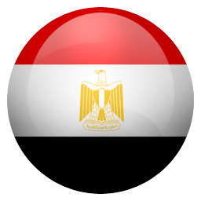

# Flags

Flags is a **Flutter 3.9.16** application that quizzes users on their knowledge of country flags. The app displays a country name, and the user must select the correct flag from three options. The app keeps track of the user's score.

### Prerequisites

- **Flutter 3.9.16**
- Dart

## Features

- Display a country name and three flag options
- Allow users to select the correct flag
- Keep track of the user's score
- Randomize flag options for each question

## How to Play
1. The app will display the name of a country.
2. Select the correct flag from the three options provided.
3. Your score will increase for each correct answer.
4. A new question will be generated after each attempt.

## Project Structure

The project structure is organized as follows:

```text
lib/
├── main.dart
|── models/
│    └── country.dart
├── pages/
│    └── quiz.dart
└── widgets/
     └── flagimage.dart
assets/
├── ar.png
├── au.png
├── br.png
├── ca.png
├── ch.png
├── ci.png
├── cm.png
├── cy.png
├── eg.png
├── es.png
├── gh.png
├── gr.png
├── jm.png
├── jp.png
├── kz.png
├── mt.png
├── mx.png
├── pt.png
├── sy.png
└── tr.png
```

- `main.dart`: Entry point of the application.
- `models/country.dart`: Defines the Country model.
- `pages/quiz.dart`: Contains the quiz logic and UI.
- `widgets/flagimage.dart`: Widget to display a flag image.

## Code Overview

### main.dart

```dart
// Import necessary packages
import 'package:flags/pages/quiz.dart';
import 'package:flutter/material.dart';

void main() {
  runApp(const FlagsApp()); // Entry point of the application
}

// Root of the Flags App
class FlagsApp extends StatelessWidget {
  const FlagsApp({super.key});

  @override
  Widget build(BuildContext context) {
    return MaterialApp(
      debugShowCheckedModeBanner: false, // Hides the debug banner
      title: 'Flags', // Title of the app
      theme: ThemeData(
        colorScheme: ColorScheme.fromSeed(seedColor: Colors.blue), // App theme
      ),
      home: const QuizPage(), // Default page is QuizPage
    );
  }
}
```

### country.dart

```dart
// Model class representing a Country
class Country {
  String flag; // Name of the flag image file (e.g., 'ar' for Argentina)
  String name; // Full name of the country

  // Constructor to initialize the flag and name
  Country(this.flag, this.name);
}
```

### quiz.dart

```dart
// Import necessary packages
import 'dart:math';
import 'package:flutter/material.dart';
import 'package:flags/models/country.dart';
import 'package:flags/widgets/flagimage.dart';

// QuizPage is a stateful widget to handle the quiz logic
class QuizPage extends StatefulWidget {
  const QuizPage({super.key});

  @override
  State<QuizPage> createState() => _QuizPageState();
}

// State class for QuizPage
class _QuizPageState extends State<QuizPage> {
  final double _padding = 15.0; // Padding used in layout
  String _textAnswer = ""; // The current correct answer (country name)
  int _score = 0; // Current score of the player
  late int _correctAnswer; // Index of the correct answer
  final List<String> _flags = ["", "", ""]; // Stores the flag options

  // List of countries for the quiz
  final List<Country> _countries = [
    Country('ar', 'Argentina'),
    Country('br', 'Brazil'),
    Country('ca', 'Canada'),
    Country('es', 'Spain'),
    Country('mx', 'Mexico'),
    Country('pt', 'Portugal'),
    Country('tr', 'Turkey'),
    Country('gr', 'Greece'),
    Country('eg', 'Egypt'),
    Country('au', 'Australia'),
    Country('ci', 'Côte d\'Ivoire'),
    Country('cm', 'Cameroon'),
    Country('cy', 'Cyprus'),
    Country('gh', 'Ghana'),
    Country('jm', 'Jamaica'),
    Country('jp', 'Japan'),
    Country('kz', 'Kazachstan'),
    Country('mt', 'Malta'),
    Country('sy', 'Syria'),
    Country('ch', 'Switzerland')
  ];

  @override
  void initState() {
    super.initState();
    _createQuestion(); // Generate the first question when the page loads
  }

  // Function to shuffle a list of items (used for randomizing the options)
  List shuffle(List items) {
    var random = Random();

    for (var i = items.length - 1; i > 0; i--) {
      var n = random.nextInt(i + 1);

      var temp = items[i];
      items[i] = items[n];
      items[n] = temp;
    }

    return items;
  }

  @override
  Widget build(BuildContext context) {
    return Scaffold(
      appBar: AppBar(
        title: const Text("Flags"), // Title in the AppBar
        backgroundColor: Colors.blue, // AppBar background color
        foregroundColor: Colors.white, // Text color
      ),
      body: Container(
        padding: const EdgeInsets.all(15.0), // Padding around the body
        child: Column(
          children: <Widget>[
            Container(
              height: 80, // Empty space for spacing
            ),
            Padding(
              padding: EdgeInsets.only(bottom: _padding, top: _padding),
              child: const Text(
                "Pick the right flag!", // Instruction for the player
                textScaleFactor: 2, // Scales the text size
              ),
            ),
            Padding(
              padding: EdgeInsets.only(bottom: 2 * _padding, top: 3 * _padding),
              child: Text(
                _textAnswer, // Display the name of the country to guess
                textScaleFactor: 4,
              ),
            ),
            // Row to display the three flag options
            Row(
              mainAxisAlignment: MainAxisAlignment.center,
              children: <Widget>[
                FlagImage(
                    flag: _flags[0], // First flag option
                    onPressed: (flag) {
                      _checkResult(flag); // Check if this is the correct flag
                    }),
                FlagImage(
                    flag: _flags[1], // Second flag option
                    onPressed: (flag) {
                      _checkResult(flag);
                    }),
                FlagImage(
                    flag: _flags[2], // Third flag option
                    onPressed: (flag) {
                      _checkResult(flag);
                    }),
              ],
            ),
            Container(
              height: 80, // Empty space for spacing
            ),
            // Display the current score
            Padding(
                padding: EdgeInsets.only(top: 3 * _padding),
                child: Row(
                    mainAxisAlignment: MainAxisAlignment.center,
                    children: <Widget>[
                      const Text(
                        "Score : ", // Score label
                        textScaleFactor: 3,
                      ),
                      Text(
                        _score.toString(), // Display the score as a string
                        textScaleFactor: 3,
                      ),
                    ])),
          ],
        ),
      ),
    );
  }

  // Function to create a new question with random flags
  void _createQuestion() {
    var random = Random();
    List countries = shuffle(_countries); // Shuffle the list of countries

    _correctAnswer =
        random.nextInt(3); // Randomly pick the correct answer index
    setState(() {
      _textAnswer =
          countries[_correctAnswer].name; // Set the correct country name
      // Set the flag options
      _flags[0] = countries[0].flag;
      _flags[1] = countries[1].flag;
      _flags[2] = countries[2].flag;
    });
  }

  // Function to check if the selected flag is correct
  void _checkResult(String answer) {
    if (_textAnswer == _countries.singleWhere((c) => (c.flag == answer)).name) {
      setState(() {
        _score = _score + 1; // Increase the score if the answer is correct
      });
    }

    _createQuestion(); // Generate a new question after checking the result
  }
}
```

### flagimage.dart

```dart
// Import necessary packages
import 'package:flutter/material.dart';

// Type definition for a callback when a flag is selected
typedef MyCallback = void Function(String flag);

// Stateless widget to display the flag image
class FlagImage extends StatelessWidget {
  final String flag; // The flag image file (e.g., 'ar' for Argentina)
  final MyCallback onPressed; // Callback function when the flag is tapped

  const FlagImage({super.key, required this.flag, required this.onPressed});

  @override
  Widget build(BuildContext context) {
    // Load the image of the flag from the assets folder
    AssetImage asset = AssetImage("assets/$flag.png");
    Image image = Image(image: asset, width: 100.0, height: 100.0);
    return GestureDetector(
      // Detect tap on the flag and trigger the callback
      onTap: () {
        onPressed(flag);
      },
      // Container to wrap the image
      child: Container(
        padding: const EdgeInsets.only(top: 20.0),
        child: image,
      ),
    );
  }
}
```

## Assets





