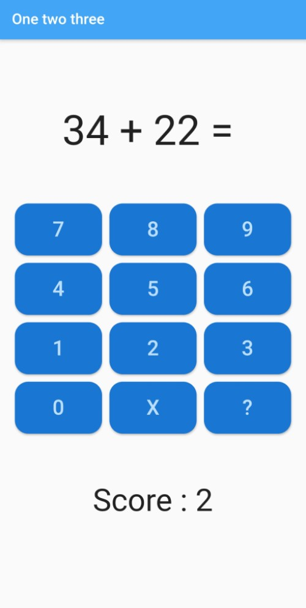

# Exercise - One two three (part 1)

In this exercise you will develop an app with which primary school children can practice their arithmetic skills. In the first part, you will design the UI. In the second part you will program the code. The app looks like this:

## Create the app
1. Create a new flutter application with name `one_two_three`.
2. Create the following directories in the `lib` folder to organize your code: `pages` and `widgets`.
3. Delete `widget_test.dart` in the `test` folder.
4. In `main.dart` open a `MaterialApp` with the right colors. The name of the app is `OneTwoThreeApp`. Remove that ugly debug banner. In the `home` property call the page widget for the default route of the app: `HomePage`.

## Design the UI of the HomePage
1. Create a new file `home.dart` in the `pages` folder.
2. Create `HomePage`, a stateless widget (for now at least). Design the UI of the page. Use a `Scaffold` widget with `AppBar`.
3. Also make use of the `Column` and `Row` widgets.
4. Create a custom widget for the buttons, namely `NumberButton`. This custom widget has a `number` property and a `onButtonPressed` callback function with one parameter, the number of the button being pressed.

## Download a font
1. Download a nice font from [Google Fonts](https://fonts.google.com/) and use it in your app.
