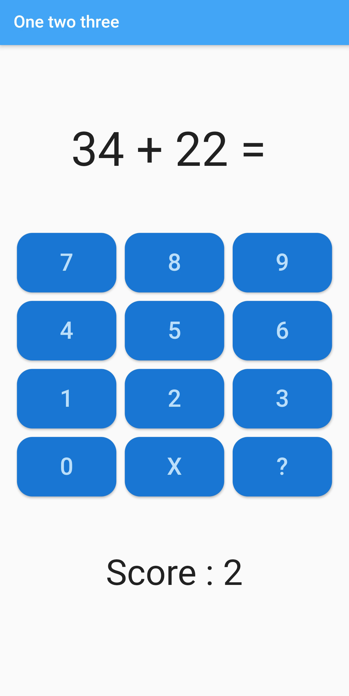

# Exercise - One two three (part 2)

This project is a simple arithmetic game built using **Flutter 3.9.16**. The app generates random arithmetic operations for the user to solve, and keeps track of the user’s score. The app looks like this:

## Stateful Widget
Open `home.dart` in the pages folder. As you can see, your `HomePage` widget is a stateless widget. Refactor the code and make your `HomePage` a stateful widget.

Create four properties in your stateful widget:
- `_operation`: the arithmatical operation that has to be calculated, "34 + 22 =" in the above example
- `_result`: the correct answer, 56 on the page above
- `_answer`: the answer of the child performing the calculus, still empty in the above screenshot
- `_score`: the current score, 2

## Complete the app
1. **Open the app** to start with a random arithmetic operation.
2. **Enter your answer** using the number buttons.
3. **Use the “X” button** to delete the last digit of your answer.
4. **Use the “?” button** to check your answer.
5. **Score** will be updated based on the correctness of your answer.
6. **A new operation** will be generated after checking your answer.
