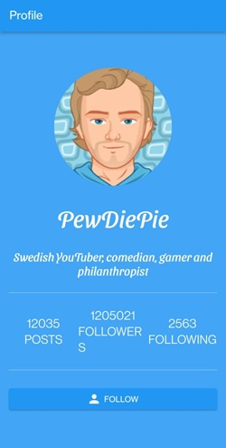
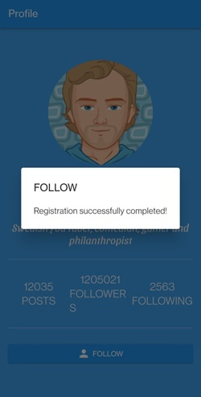
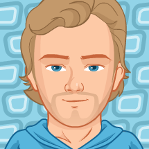

# Profile App

This is a simple profile app built using **Flutter 3.19.6**. The app demonstrates the use of various Flutter widgets and concepts such as custom widgets, state management, and modularity.

 

## Getting Started

### Prerequisites

- Flutter 3.9.16
- Dart SDK
- Visual Studio Code or any other IDE of your choice

## Project Structure

The project structure is organized as follows:

```text
lib/
├── main.dart
├── pages/
│   └── home.dart
└── widgets/
    ├── circleimage.dart
    ├── iconbutton.dart
    └── numberlabel.dart
assets/
└── pewdiepie.png
```
## Code Overview

### main.dart

```dart
import 'package:flutter/material.dart';
import 'package:profile_app/pages/home.dart';

// Entry point of the application
void main() {
  runApp(const ProfileApp()); // Run the ProfileApp as the root widget
}

// Main ProfileApp widget
class ProfileApp extends StatelessWidget {
  const ProfileApp({Key? key}) : super(key: key);

  // The build method creates the UI structure of the ProfileApp
  @override
  Widget build(BuildContext context) {
    return MaterialApp(
      debugShowCheckedModeBanner: false, // Hides the debug banner
      title: 'Profile', // Sets the application title
      theme: ThemeData(
        primarySwatch: Colors.blue, // Sets the primary theme color
      ),
      home: const HomePage(), // Sets HomePage as the initial screen
    );
  }
}
```

### home.dart

```dart
import 'package:flutter/material.dart';
import 'package:profile_app/widgets/numberlabel.dart';
import 'package:profile_app/widgets/circleimage.dart';
import 'package:profile_app/widgets/iconbutton.dart';

// HomePage widget representing the main screen
class HomePage extends StatelessWidget {
  const HomePage({Key? key}) : super(key: key);

  @override
  Widget build(BuildContext context) {
    return Scaffold(
      appBar: AppBar(
        title: const Text("Profile"), // AppBar title
      ),
      body: Container(
        padding: const EdgeInsets.all(15.0), // Adds padding around the content
        alignment: Alignment.center, // Centers the content
        color: Colors.blue[400], // Sets the background color
        child: Column(
          mainAxisAlignment:
              MainAxisAlignment.center, // Centers the column's children
          children: <Widget>[
            const CircleImageWidget(
              imageName: "assets/pewdiepie.png", // Displays a circular image
            ),
            const SizedBox(height: 30), // Adds vertical spacing
            const Text(
              "PewDiePie", // Displays the profile name
              style: TextStyle(
                  fontSize: 40.0,
                  decoration: TextDecoration.none,
                  fontFamily: 'SansitaSwashed',
                  fontWeight: FontWeight.normal,
                  color: Colors.white),
            ),
            const SizedBox(height: 30), // Adds vertical spacing
            const Text(
              "Swedish YouTuber, comedian, gamer and philanthropist",
              style: TextStyle(
                  fontSize: 20.0,
                  decoration: TextDecoration.none,
                  fontFamily: 'SansitaSwashed',
                  fontWeight: FontWeight.normal,
                  color: Colors.white),
              textAlign: TextAlign.center, // Centers the text
            ),
            const Divider(height: 50.0, color: Colors.white), // Divider line
            const Row(children: <Widget>[
              // Displays three NumberLabelWidgets
              NumberLabelWidget(
                count: 12035,
                text: "posts",
              ),
              NumberLabelWidget(
                count: 1205021,
                text: "followers",
              ),
              NumberLabelWidget(
                count: 2563,
                text: "following",
              ),
            ]),
            const Divider(height: 50.0, color: Colors.white), // Divider line
            IconButtonWidget(
                icon: Icons.person,
                text: "follow",
                onButtonPressed: (text) {
                  _follow(text,
                      context); // Calls the _follow method on button press
                }),
          ],
        ),
      ),
    );
  }

  // Private method to display an alert dialog when the follow button is pressed
  void _follow(String text, BuildContext context) {
    var alert = AlertDialog(
      title: Text(text.toUpperCase()), // Display the button text as uppercase
      content: const Text("Registration successfully completed!"),
    );
    showDialog(context: context, builder: (BuildContext context) => alert);
  }
}
```

### circleimage.dart

```dart
import 'package:flutter/material.dart';

// A stateless widget to display a circular image
class CircleImageWidget extends StatelessWidget {
  final String imageName; // Path to the image asset

  const CircleImageWidget({Key? key, required this.imageName})
      : super(key: key);

  @override
  Widget build(BuildContext context) {
    AssetImage avatarAsset = AssetImage(imageName); // Load the image asset
    return CircleAvatar(
      radius: 100.0, // Sets the size of the circle
      backgroundImage: avatarAsset, // Displays the loaded image
    );
  }
}
```

### iconbutton.dart

```dart
import 'package:flutter/material.dart';

// Typedef for the callback function when the button is pressed
typedef MyCallback = void Function(String text);

// A stateless widget that displays an icon button with text
class IconButtonWidget extends StatelessWidget {
  final String text; // Text label for the button
  final IconData icon; // Icon displayed on the button
  final MyCallback
      onButtonPressed; // Callback function when the button is pressed

  const IconButtonWidget(
      {Key? key,
      required this.text,
      required this.icon,
      required this.onButtonPressed})
      : super(key: key);

  @override
  Widget build(BuildContext context) {
    return ElevatedButton(
      child: Row(
        mainAxisAlignment:
            MainAxisAlignment.center, // Centers the icon and text
        children: <Widget>[
          Icon(icon), // Displays the icon
          const SizedBox(
            width: 5, // Adds space between the icon and text
          ),
          Text(text.toUpperCase()) // Displays the text in uppercase
        ],
      ),
      onPressed: () {
        onButtonPressed(
            text); // Executes the callback when the button is pressed
      },
    );
  }
}
```

### numberlabel.dart

```dart
import 'package:flutter/material.dart';

// A stateless widget that displays a count with a label
class NumberLabelWidget extends StatelessWidget {
  final String text; // Label text
  final int count; // Numerical count to display

  const NumberLabelWidget({Key? key, required this.text, required this.count})
      : super(key: key);

  @override
  Widget build(BuildContext context) {
    return Expanded(
      child: Column(
        children: <Widget>[
          Text(
            count.toString(), // Display the count as a string
            style: const TextStyle(
              fontSize: 20.0,
              decoration: TextDecoration.none,
              color: Colors.white,
              fontWeight: FontWeight.normal,
            ),
          ),
          Text(
            text.toUpperCase(), // Display the label text in uppercase
            style: const TextStyle(
              fontSize: 20.0,
              decoration: TextDecoration.none,
              color: Colors.white,
              fontWeight: FontWeight.normal,
            ),
          ),
        ],
      ),
    );
  }
}
```

## Assets



## Custom Widgets

- **CircleImageWidget**: Displays a rounded image.
- **IconButtonWidget**: Displays a button with an icon and text.
- **NumberLabelWidget**: Displays a number and a label.